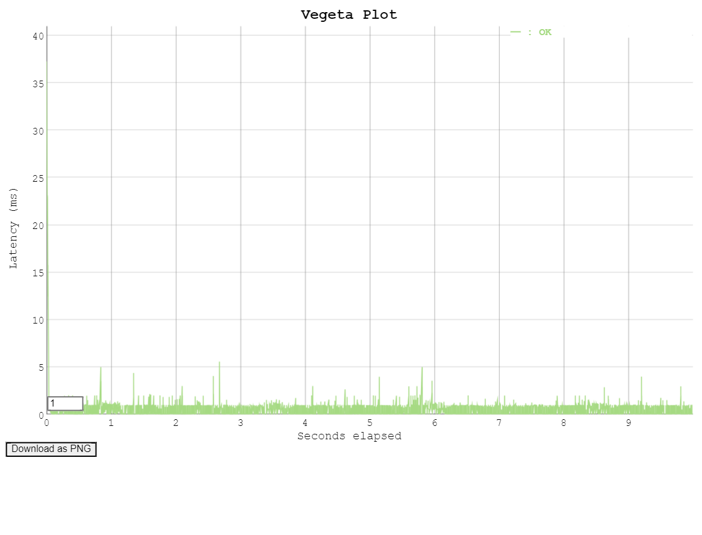
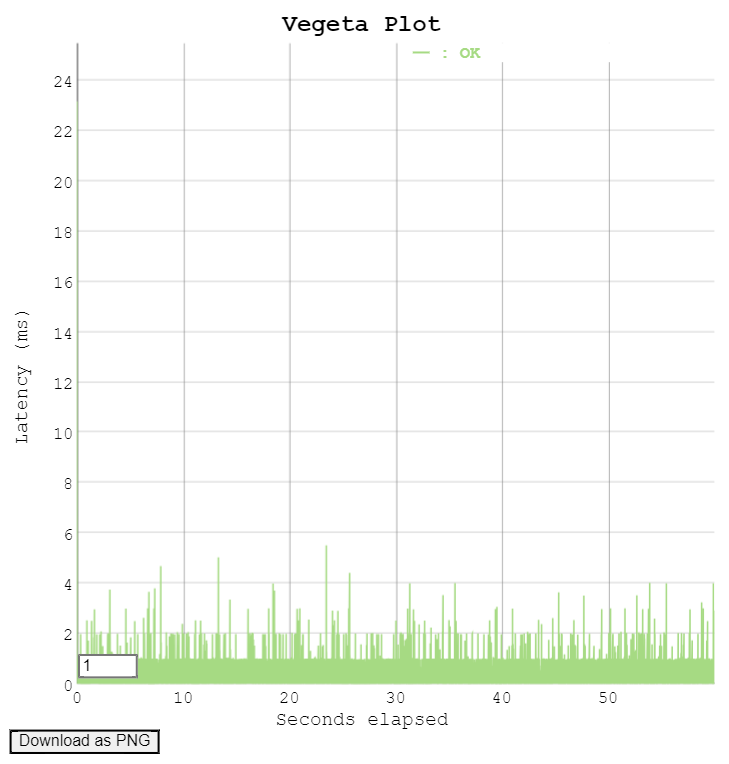
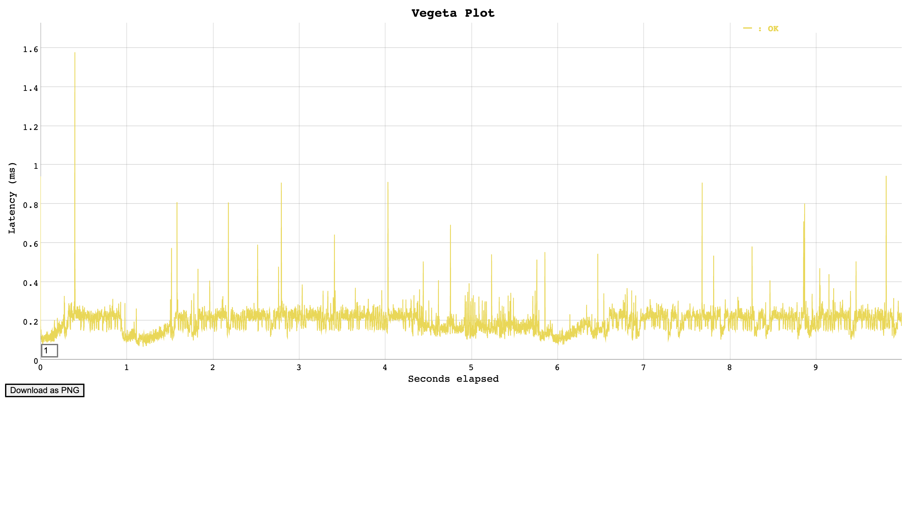
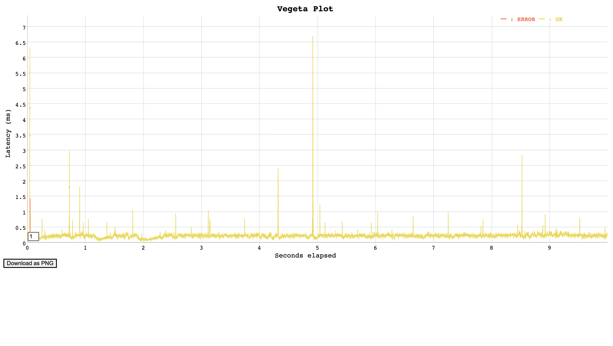
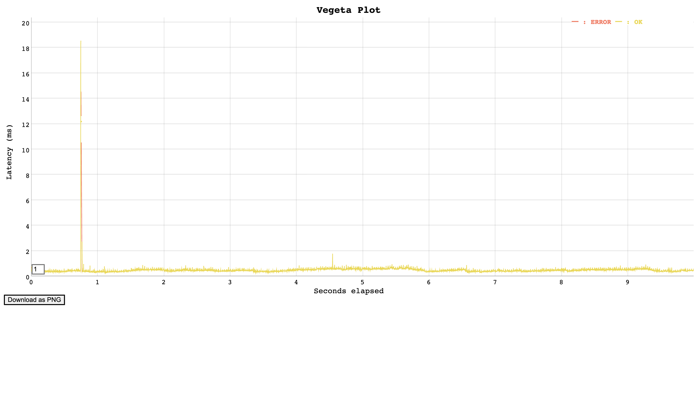
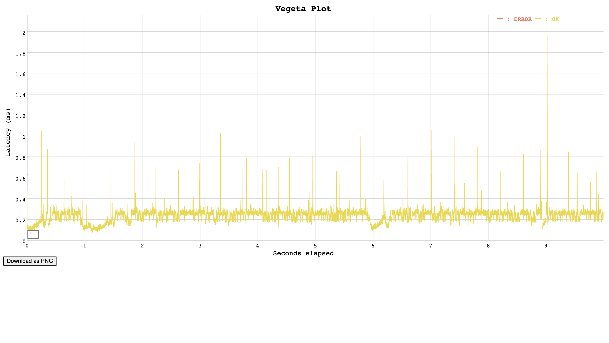
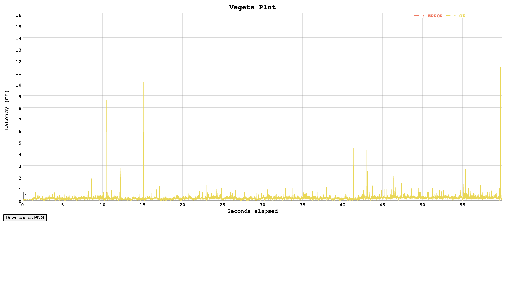

# Design Document

## Overview

Modern OLAPs are designed to perform analytic queries, with which we often need to do subqueries, joins, and aggregation. The problem is that the query optimizer needs metadata and statistics, such as data distribution and indexes to do a better job. To solve this problem, we need to build a catalog that serves as a “database of metadata for the database” that stores statistics from the execution engine and data discovery from I/O services, and that provides metadata to the planner and data location to schedule the query.

## Architectural Design


#### Input/Output

We will be exposing a REST API for interaction with other components. The inputs and results for the same are a part of the API Spec.

#### Components

The components of our architecture include the rust service application and rocksDB as an embedded database.

##### Rust Application

A Rust application that exposes a REST API to modify database metadata of the OLAP database. The application consists of the following components:

- A data model that defines the structure and meaning of the metadata we store, such as schemas, tables, columns, measures, dimensions, hierarchies, and levels. The data model is represented by Rust structs that can be serialized and deserialized using Substrait.
- A database layer that interacts with RocksDB. The database layer provides methods for storing and retrieving the database metadata as key-value pairs using the RocksDB crate.
- A service layer that contains the business logic for the REST API, such as validating inputs, checking permissions, handling errors, etc. The service layer depends on the database layer and uses the data model to manipulate the database metadata.
- A controller layer that exposes the service methods as RESTful endpoints using a web framework, such as warp or axum. The controller layer uses the web framework’s features, such as filters, macros, and async functions, to parse the request parameters and format the response.

##### Database for metadata

We choose RocksDB as the database in the catalog to store metadata. It is a fast and persistent key-value store that can be used as an embedded database for Rust applications.


## Design Rationale

Most design decisions were made with the assumption that we do not have any schema updates and writes are infrequent with bulk data

#### Database

We contemplated two embedded database candidates for catalog service: SQLite and RocksDB. We chose RocksDB because

1. Better concurrency control: SQLite locks the entire database when dealing with concurrency writing, whereas RocksDB supports snapshots.
2. Flexibility: RocksDB provides more configuration options.
3. Scalability: RocksDB stores data in different partitions, whereas SQLite stores data in one single file, which isn’t ideal for scalability.

#### Why a key-value store?

1. Based on [1], the catalog for an OLAP system behaves a lot like an OLTP database. They state how using a key-value store in the form of FoundationDB has proved to be beneficial based on performance and scalability. This includes supporting high-frequency reads, and support for dynamic metadata storage.
2. [2] compares and benchmarks the performance of tabular storage vs hierarchical organization of metadata as seen in Iceberg and finds the single node processing in Iceberg performs better than the others for small tables but fails to scale. It concludes that the metadata access patterns have a significant impact on the performance of distributed query processing.
3. Taking these factors into account, we have decided to go ahead with a key-value store for the simplicity and flexibility it provides along with the performance benefits.

#### Axum

After looking through several available options to use build APIs, such as Hyper and Actix, we have selected Axum.

- Axum framework is built on top of Hyper and Tokio and abstracts some of the low level details
- This, however, does not result in any significant performance overhead.
- Benchmarks for frameworks are listed in [3]

## Testing plan

A detailed description of how you are going to determine that your implementation is both (1) correct and (2) performant. You should describe the short unit tests and long running regression tests. Some portion of your testing plan must also use your project's public API, thus you are allowed to share testing infrastructure with the other group implementing the same thing.

### Correctness testing

#### Unit tests

For the correctness of the catalog, we plan to conduct unit tests and regression tests. In unit testing, we will test key components and operations such as metadata retrieval, metadata storage, update, and snapshot isolation.


### Performance testing
1. Concurrency Workloads: Test the performance under concurrent access by simulating multiple clients performing various operations simultaneously (e.g., multiple clients creating tables, querying metadata, committing snapshots, etc.).
2. Large Schemas and Datasets: Evaluate the performance with tables having a large number of columns (e.g., hundreds or thousands of columns) and large datasets with many partitions or snapshots.
3. Mixed Workloads: Combine different types of operations in a single workload to simulate a more realistic scenario where various operations are performed concurrently.


## Trade-offs and Potential Problems
- The biggest trade-off being made in the current design is the absence of any optimizations for updates. Updates to any tables will result in the metadata of the tables stored to become stale. Efficiently updating these values is a design challenge. This has not been prioritized based on the assumption that updates in an OLAP system will be infrequent.

- We chose RocksDB to store metadata, whereas Iceberg Catalog has its own metadata layer that includes metadata files, manifest lists, and manifests. Using RocksDB could be more straightforward to implement compared to building everything from scratch. The components in Iceberg Catalog are likely to be optimized for Iceberg Catalog, and they could outperform RocksDB, which is not dedicated to catalog service.

## Support for Parallelism
Our catalog service is designed to support parallelism to enhance performance. This is achieved through the following ways:
1. **Concurrency Control in RocksDB**: RocksDB, our chosen database, supports concurrent reads and writes. This allows multiple threads to read and write to the database simultaneously, improving the throughput of our service.

2. **Asynchronous API**: The REST API exposed by our Rust application is asynchronous, meaning it can handle multiple requests at the same time without blocking. This is particularly useful for operations that are I/O-bound, such as reading from or writing to the database.


## Performance Tuning Plan
Performance tuning is crucial for the efficiency and speed of our catalog service. Here's our plan:

1. **API Optimization**: We will monitor the performance of our API endpoints and optimize the slow ones. This will involve optimizing the database access methods and refactoring the code.

1. **Load Testing**: We will conduct load testing to understand how our service performs under heavy load. This will help us identify bottlenecks and areas for improvement.

## Milestones

:white_check_mark: 75%: Basic API support
:white_check_mark: 100%: Support for parallelism and performance tuning
:white_check_mark: 125%: Performance testing ~~against Iceberg Catalog~~

## Performance Testing Results

**Command to run benchmark script**
```sh
python3 benchmarking/bench.py -b catalog1 -d ../rocksdb -u http://localhost:3000 -n 100 -t 1000 -r 1000 -p
```

### Windows 
#### Host Specifications
```
OS: Windows 11 Home x86_64
Host: HP OMEN Laptop 15-en0xxx
Kernel: 10.0.22631
CPU: AMD Ryzen 7 4800H with Radeon Graphics (16) @ 2.900GHz
GPU: Caption
GPU: AMD Radeon(TM) Graphics
GPU: NVIDIA GeForce GTX 1660 Ti
Memory: 13769MiB / 15731MiB
```
#### Get Namespace API
```
Requests      [total, rate, throughput]  9991, 999.20, 999.20
Duration      [total, attack, wait]      9.9989534s, 9.9989534s, 0s
Latencies     [mean, 50, 95, 99, max]    860.52µs, 972.607µs, 1.452413ms, 2.987446ms, 37.2744ms
```


#### Get Table API
```
Requests      [total, rate, throughput]  10000, 999.55, 999.55
Duration      [total, attack, wait]      10.004488s, 10.004488s, 0s
Latencies     [mean, 50, 95, 99, max]    865.783µs, 972.728µs, 1.418071ms, 3.01372ms, 37.3176ms
```


#### List Namespace API
```
Requests      [total, rate, throughput]  10000, 1001.10, 1001.05
Duration      [total, attack, wait]      9.9895398s, 9.9890283s, 511.5µs
Latencies     [mean, 50, 95, 99, max]    1.883553ms, 1.191091ms, 5.006752ms, 8.196381ms, 43.6933ms
```


#### List Tables API
```
Requests      [total, rate, throughput]  9992, 999.50, 999.50
Duration      [total, attack, wait]      9.9970348s, 9.9970348s, 0s
Latencies     [mean, 50, 95, 99, max]    971.232µs, 973.659µs, 1.978657ms, 3.292131ms, 45.7625ms
```


#### Random Testing
```
Requests      [total, rate, throughput]  59995, 1000.02, 1000.02
Duration      [total, attack, wait]      59.9940374s, 59.9940374s, 0s
Latencies     [mean, 50, 95, 99, max]    526.566µs, 522.409µs, 1.027574ms, 2.010563ms, 23.165ms
```

### MacBook Air M1 
#### Host Specifications
```
OS: macOS 14.4.1 23E224 arm64 
Host: MacBookAir10,1 
Kernel: 23.4.0 
WM: Quartz Compositor 
WM Theme: Blue (Dark) 
Terminal: vscode 
CPU: Apple M1 
GPU: Apple M1 
Memory: 1514MiB / 8192MiB 
```

#### Get Namespace API
```
Requests      [total, rate, throughput]         10000, 1000.10, 1000.08
Duration      [total, attack, wait]             9.999s, 9.999s, 213µs
Latencies     [min, mean, 50, 90, 95, 99, max]  65.833µs, 191.877µs, 196.477µs, 243.657µs, 256.028µs, 305.26µs, 1.578ms

```

#### Get Table API
```
Requests      [total, rate, throughput]         10000, 1000.10, 999.27
Duration      [total, attack, wait]             9.999s, 9.999s, 268.708µs
Latencies     [min, mean, 50, 90, 95, 99, max]  70.166µs, 221.648µs, 223.806µs, 262.714µs, 279.431µs, 394.982µs, 6.708ms
```

#### List Namespace API
```
Requests      [total, rate, throughput]         10000, 1000.11, 999.16
Duration      [total, attack, wait]             9.999s, 9.999s, 498.75µs
Latencies     [min, mean, 50, 90, 95, 99, max]  272.708µs, 478.628µs, 452.66µs, 580.816µs, 605.989µs, 726.08µs, 18.557ms
```

#### List Tables API
```
Requests      [total, rate, throughput]         10000, 1000.10, 999.97
Duration      [total, attack, wait]             9.999s, 9.999s, 254.458µs
Latencies     [min, mean, 50, 90, 95, 99, max]  73.625µs, 235.993µs, 249.85µs, 283.297µs, 296.26µs, 365.961µs, 1.97ms
```

#### Random Testing
```
Requests      [total, rate, throughput]         60000, 1000.02, 999.93
Duration      [total, attack, wait]             59.999s, 59.999s, 86.666µs
Latencies     [min, mean, 50, 90, 95, 99, max]  54.708µs, 186.655µs, 171.961µs, 252.694µs, 278.067µs, 429.093µs, 14.688ms
```

### References

[1] https://www.snowflake.com/blog/how-foundationdb-powers-snowflake-metadata-forward/
[2] https://15721.courses.cs.cmu.edu/spring2024/papers/18-databricks/p92-jain.pdf
[3] https://github.com/programatik29/rust-web-benchmarks/blob/master/result/hello-world.md
